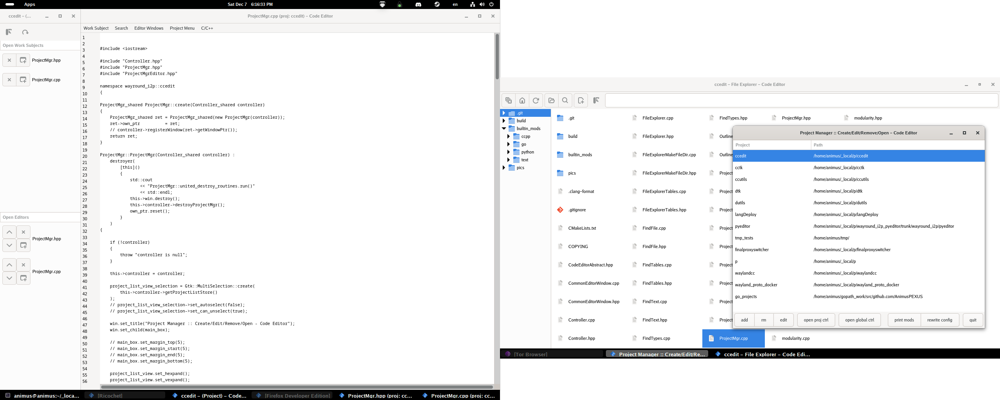

# About ccedit

As I don't like M$ Code, I preferred to write my own code editor as I see it fit.

## Features

* Simultenious multiproject
* Multiwindow: for multimonitor systems it's better
* Separate window with listing of open files (Work Subjects) and open editors
* Some small file explorer, enough for creating new dirs and files
* File/Text search

## what's absent and currently not planned

* outline
* syntax highliting

## what's planned

* better unicode support via ccutils
* using own regexp engine from ccutils

## Screenshots

  On two monitors 
  One Project open 
  Two files open 
  One editor visible 
  Using Gnome 47 window tilling capabilities 

